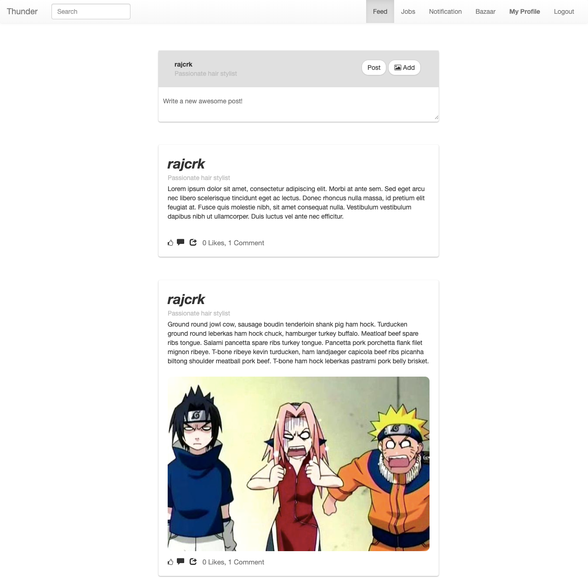

###### Submission by, Raj Kumar C
rajkumar.cind@gmail.com
###### URL for Deployed version on heroku
https://thunder-crayond.herokuapp.com/

# Crayon`d Task 
## How to setup and test this appilcation
### What I have done ?
I have created a way where users can post images or post just text, much like a social platform.The functionalities that the user can do are.
<li> Register for an account
<li> Create a Post ( with or without image )
<li> Like a post
<li>View his own post
<li>Search for posts
<br>

## Tech Stack
#### Front End
<li>HTML
<li>CSS
<li>EJS Templating Engine
<li>JQuery
<li>Some pretty Images from Unsplash. :-)
<li>Boostrap Library 3.3.7

#### Back End ( The Important Stuff )
<li>Node Js
<li>Mongo DB

#### Node Modules I`ve Used
<li> Passport Js - For Authentication
<li>mongoose
<li>Express Js
<li>passport-local
<li>multer

## What you need to run this application
Since this is a Node application, make sure that you have Node Js installed on your system.<br>
You should also be having mongoDB installed and active in your system, make sure that mongoDB is running on the default MongoDB port ( 27017 ).

## Running this application
I have included a compressed file. Extract the compressed file and change directory into the extracted folder.<br>
Just to be sure run this command, so that we dont miss out any module files.<br>

```shell
npm install
```
After starting up mongodb service, run this application by typing in the command.
```shell
node app
```
This application will run locally on port 1234, go to this URL to access the application.
```shell
http://localhost:1234/
```
### How this application works ?.
To create or view a post you must have an account. So when you are running this application for the first time do create an account.<br>
Ive set certain constraints where you can only access certain API only if you have logged in. The login session is stored on the client side as a hash and the other hash for the session is maintained at the server side along with a key, both are compared to authenticate the user.
<br>
To manage authenication I`ve used Passport Js.( Just trying not to reinvent the wheel )
### DB Schema

 

### Implementation Details
You need to have an account to post as well as like post.<br>
I have included a middleware to check if the user is authenticated to access a particular API.

###### Login Page

###### Registration Page
You can register by providing a unique username, ( It has to be unique, I have checked for this on the Node Js part )
If the username that you picked already exists then you will be retured back to the registration page <br>I mainly focused on the back-end part.<br>

###### Home Page
After you have logged in, you are redirected to the new feed page. Here you can view all post as well as like a post.<br>

###### Search Post
You can search for a post by typing in the content you want to search in the search input field provided in the navigation bar.<br>
The content that you provide will be matched with the content of the posts in the mongoDB.

###### User Profile
This is where you can see the user information ( Not much in this application ) such as the username and the content that you have posted,
<br>

 


###### If there is any questions regarding my application, Do feel free to reach out to me.
rajkumar.cind@gmail.com
(+91) 7708464536
## <i>The End</i>
### <i> Thanks Guys, Had fun working on this ! </i>

